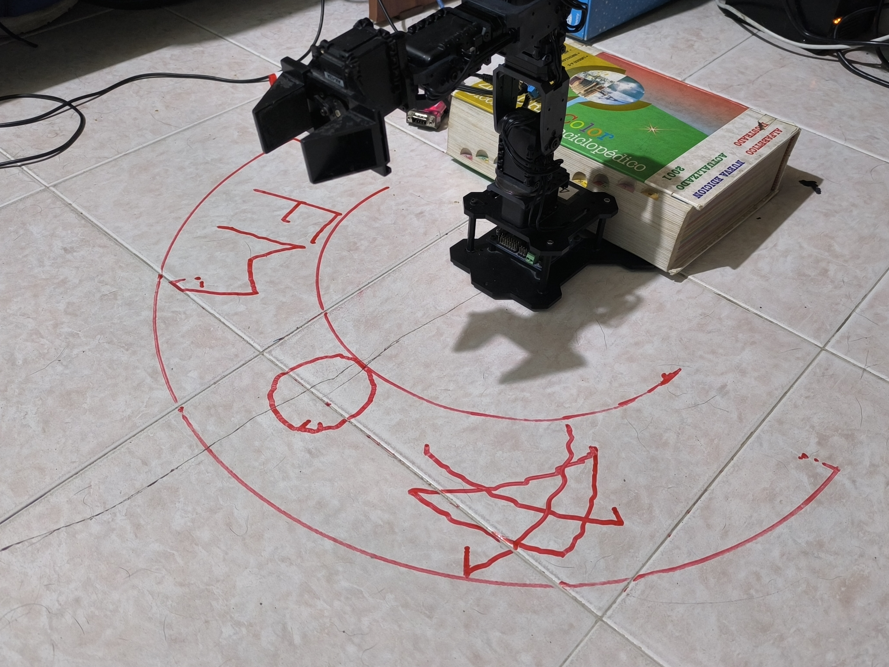
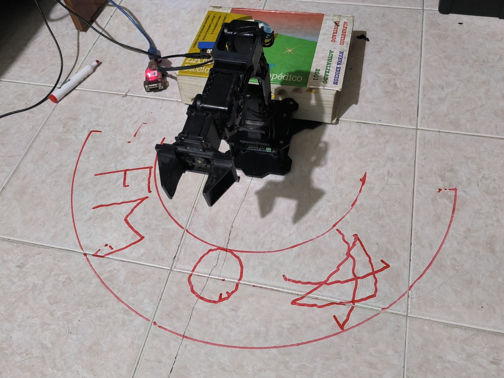

# Laboratorio 5 - Cinemática Inversa - Phantom X - ROS

***INTEGRANTES***

* Marco Antonio Quimbay Dueñas
* Felipe Chaves Delgadillo

Para llevar a cabo la práctica, el primer paso consistió en hacer la Cinemática Directa del Robot en la posición de Home y así obtener los parámetros de DH. En la figura pueden observarse las distintas distancias que existen entre los eslabones del robot, y sus respectivas magnitudes, adquiridas mediante el uso de un calibrador.

Obteniendo la siguiente DH:

## Implementación en ROS

Después de sacar el modelo geométrico inverso, se procedió a implementar la solución en ROS teniendo en cuenta las recomendaciones de la guía, por lo que para realizar dichos puntos, se hizo un solo programa en la cual se integra todos los puntos, primero importamos las librerias necesarias para el funcionamiento del programa:

Después programamos lo que es la cadena cinemática del robot con los parámetros DH encontrados al principio, con la ayuda de la libreria de Peter Corke:

Ahora debemos programar el modelo cinemático inverso teniendo en cuenta que el piso está mucho más abajo de la base del robot por lo que se deben programar unas coordenadas auxiliares y esta función nos devuelve los ángulos respectivos de cada unión:

Ahora programamos la función del publicador de posición en el cual mostramos la posición espacial del TCP, y se realiza la cinemática inversa del punto actual para luego enviarlos al tópico respectivo:

Ahora programamos lo que es el publicador de los ángulos de las uniones, la idea es complementar el publicador anterior: 

Por último programamos lo que es el programa principal en forma de función, aquí vamos a utilizar las funciones anteriores para realizar las rutinas de dibujo las cuales corresponden al dibujo del área máxima y mínima de dibujo, las iniciales de los nombres de los integrantes del grupo, un circulo y por último, triangulo con una x dibujada en el medio, para cada rutina se importa la imagen con CV2 y se muetsra, una vez cerrada la imagen, el robot comienza la rutina elegida y cada una tiene una lista de puntos, los cuales indican las posiciones de todos los lugares en donde se dibuja y el tiempo de ejecución de cada rutina: 

Finalmente, tenemos el código principal en el cual se llama la función principal y se da un tiempo de espera entre llamadas: 

Cabe aclarar que la interfaz HMI se programó para la consola de linux.

**Resultados**

Los trazos que funcionan con el giro de una sola unión, se denotan muy claros y limpios, sin embargo, cuando son movimientos lentos y cortos, al robot le cuesta seguir una trayectoria limpia.
